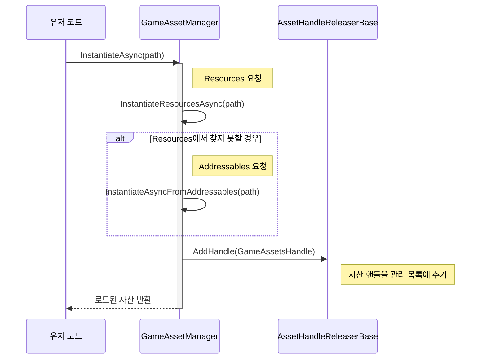
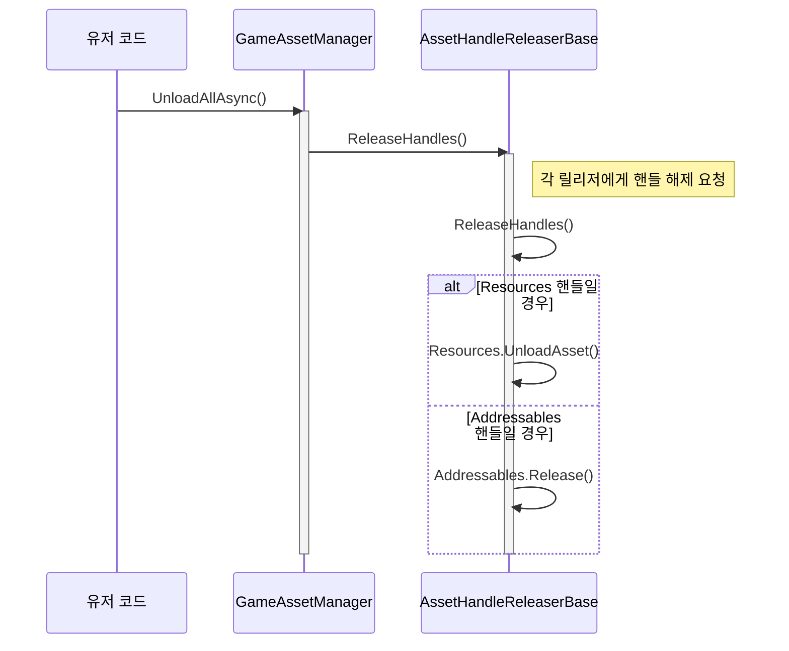
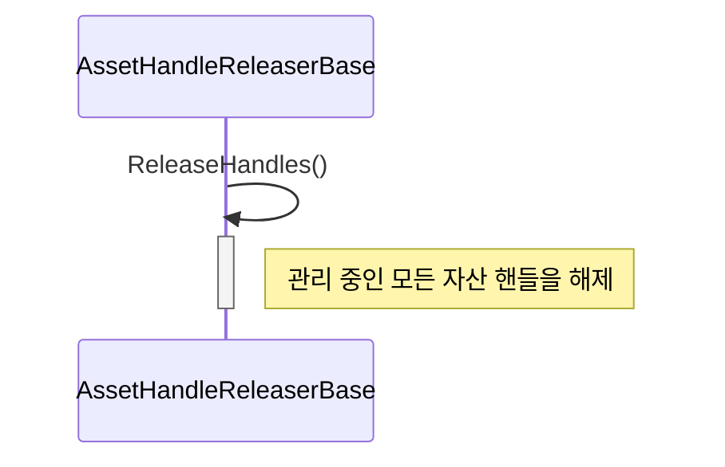

# ApeFramework

ApeFramework는 Unity 기반의 게임 개발 프레임워크입니다. 다양한 매니저 시스템을 통해 복잡한 작업을 단순화하고, 개발 효율성을 높이는 것을 목표로 합니다.

***

## GameAsset: 자산 통합 관리
Unity 프로젝트의 자산(Asset)을 통합 관리하는 시스템입니다. Unity의 Resources와 Addressables는 각기 다른 로드 방식과 메모리 관리 규칙을 가지고 있어 함께 사용할 때 복잡성을 야기하고 메모리 누수를 일으키기 쉽습니다. 이를 하나의 통일된 인터페이스로 제공하고, 정확한 시점에 메모리를 자동으로 해제하여 안정성과 개발 편의성을 높입니다.
* 통합 로드: Resources와 Addressables를 자동으로 구분하여 자산을 로드합니다.
* 자동 메모리 관리: GameObject의 수명에 맞춰 자산 핸들을 자동으로 해제할수 있습니다.
* 인스펙터 기반 UI: 런타임 정보를 인스펙터 창에서 실시간으로 확인할 수 있습니다.

### 인스턴스화

```csharp
// Resources 폴더의 프리팹을 인스턴스화
_ = await GameAssetManager.Instance.InstantiateAsync("ResourcesPrefab");
```


### 로드
```csharp
// Addressables 자산을 로드(로드된 자산의 수명이 해당 게임 오브젝트의 수명에 종속됩니다.)
_ = await GameAssetManager.Instance.LoadAsync<Material>(
    "Assets/ApeSamples/GameAsset/Addressables/AddressableMaterial.mat", gameObject);
```

### 전체 해제

```csharp
// 모든 자산을 한 번에 언로드
await GameAssetManager.Instance.UnloadAllAsync();
```


### 게임 오브젝트 파괴 시 자동해제

오브젝트 파괴시 관리 중인 모든 자산 핸들을 해제됩니다.



***

## GameScene: 씬 통합 관리
유니티씬을 관리합니다.
* 통합 씬 로드: Built-in 씬과 Addressables 씬을 동일한 방식으로 관리합니다.
* 안정적인 동시성 제어: 여러 씬 작업이 동시에 발생하는 것을 방지합니다.
* 인스펙터 기반 UI: 런타임 정보를 인스펙터 창에서 실시간으로 확인할 수 있습니다.


### 씬 로드
```csharp
// 빌트인 씬 로드
await GameSceneManager.Instance.LoadAdditiveAsync("ApeSamples/GameScenes/BuiltinScenes/BuiltinScene");

// 어드레서블 씬 로드
await GameSceneManager.Instance.LoadAdditiveAsync(
    "Assets/ApeSamples/GameScenes/Addressables/AddressableScene.unity");
```

### 모든 씬 언로드
```csharp
await GameSceneManager.Instance.UnloadAllAsync();
```

***

## GlobalCanceller: 비동기 작업 일괄 취소
GlobalCanceller는 모든 비동기 작업을 일괄적으로 취소할 수 있는 전역 토큰을 제공하여, 씬 전환이나 게임 종료 시 남아있는 작업을 깔끔하게 정리합니다.

### 비동기 작업 시작 및 모든 작업 취소
```csharp
...
private async UniTask LogLoopAsync(CancellationToken cancellationToken)
{
    while (true)
    {
        await UniTask.WaitForSeconds(1f, cancellationToken: cancellationToken);
    }
}
...

// 전역 취소 토큰을 사용하는 비동기 작업 시작
LogLoopAsync(GlobalCanceller.Instance.GetCancellationToken()).Forget();

// 전역 + MonoBehaviour 파괴 결합 토큰을 사용하는 비동기 작업 시작
LogLoopAsync(GlobalCanceller.Instance.GetLinkedToken(this.GetCancellationTokenOnDestroy())).Forget();

// 모든 작업을 취소
GlobalCanceller.Instance.CancelAll();
```

***

## DataModel: 데이터 모델 관리
데이터 모델을 관리하는 시스템입니다. 키(Key)의 유무와 타입에 따라 NoKey, LongKey, StringKey 세 가지 유형의 데이터 모델을 효율적으로 관리할 수 있습니다. TryGet과 TryCreate 메소드를 통해 데이터 모델을 안전하게 가져오거나 생성할 수 있습니다.

### TryCreate: 새로운 데이터 모델 인스턴스를 생성하고 관리 목록에 추가합니다.
```csharp
// Long 키 데이터 모델 생성하기
DataModelManager.Instance.TryCreate<PlayerDataModel>(123L, out var playerDataModel);
```

### TryGet: 저장된 데이터 모델을 키 타입에 따라 가져옵니다.
```csharp
// 키가 없는 데이터 모델 가져오기
DataModelManager.Instance.TryGet<GameSettingsDataModel>(out var myDataModel);
```

### Remove: 더 이상 필요 없는 데이터 모델을 제거합니다.
```csharp
// String 키 데이터 모델 제거하기
DataModelManager.Instance.Remove<ItemDataModel>("sword_1");
```

***

## UI: 뷰-프레젠터 패턴
UI 시스템은 뷰(View)와 프레젠터(Presenter)를 분리하는 MVP 패턴을 기반으로 설계되었습니다.
* 유지보수 용이: UI의 시각적 요소(View)와 비즈니스 로직(Presenter)이 완전히 분리되어 있어, 둘 중 하나를 수정해도 다른 쪽에 영향을 주지 않습니다.
* 재사용성: 동일한 프레젠터를 여러 개의 다른 뷰(예: 세로형 UI, 가로형 UI)와 연결하여 사용할 수 있습니다.
* 테스트 용이: 프레젠터는 유니티 의존성이 없기 때문에 유니티 환경 없이도 순수한 C# 코드로 단위 테스트(Unit Test)를 수행하기가 매우 용이합니다.