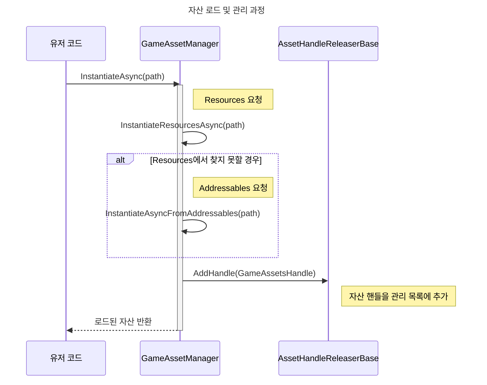
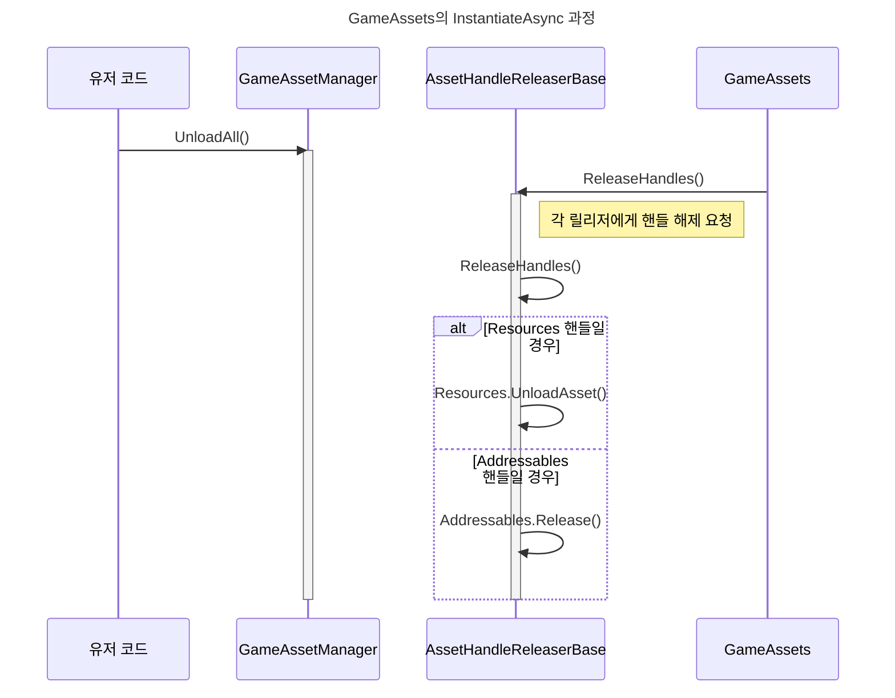
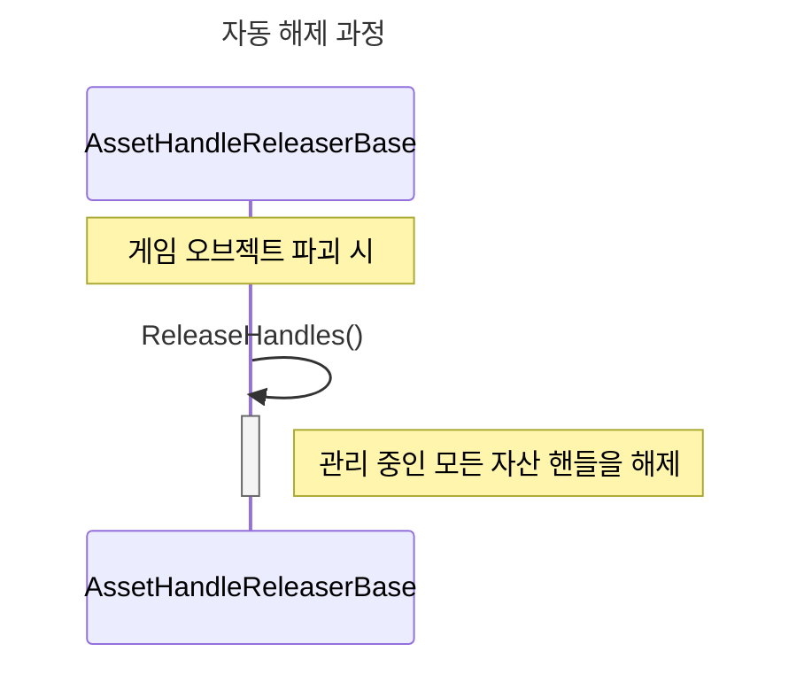

# ApeFramework 소개
<pre>
ApeFramework는 Unity 기반의 게임 개발 프레임워크입니다.
다양한 매니저 시스템을 통해 복잡한 작업을 단순화하고, 개발 효율성을 높이는 것을 목표로 합니다.
</pre>

## GameAsset: 자산 통합 관리
Unity 프로젝트의 자산(Asset)을 통합 관리하는 시스템입니다. Unity의 Resources와 Addressables는 각기 다른 로드 방식과 메모리 관리 규칙을 가지고 있어 함께 사용할 때 복잡성을 야기하고 메모리 누수를 일으키기 쉽습니다. 이를 하나의 통일된 인터페이스로 제공하고, 정확한 시점에 메모리를 자동으로 해제하여 안정성과 개발 편의성을 높입니다.
* 통합 로드: Resources와 Addressables를 자동으로 구분하여 자산을 로드합니다.
* 자동 메모리 관리: GameObject의 수명에 맞춰 자산 핸들을 자동으로 해제할수 있습니다.
* 인스펙터 기반 UI: 런타임 정보를 인스펙터 창에서 실시간으로 확인할 수 있습니다.

### 예시
````
// Resources 폴더의 프리팹을 인스턴스화
await GameAsset.Instance.InstantiateAsync("ResourcesPrefab");

// Addressables 자산을 로드(로드된 자산의 수명이 해당 게임 오브젝트의 수명에 종속됩니다.)
await GameAssets.Instance.LoadAsync<Material>(
"Assets/ApeSamples/GameAssets/Addressables/AddressableMaterial.mat", gameObject);

// 모든 자산을 한 번에 언로드
await GameAssets.Instance.UnloadAllAsync();
````

### 구현 코드
````
Ape/Runtime/GameAssets/OwnerAssetHandleReleaser.cs
/// <summary>
/// 게임 오브젝트에 종속된 자산 핸들을 관리하고 해제하는 컴포넌트입니다.
/// 이 컴포넌트가 부착된 게임 오브젝트가 파괴되면,
/// 자동으로 관리 중인 모든 자산 핸들이 해제됩니다.
/// </summary>
internal class OwnerAssetHandleReleaser : AssetHandleReleaserBase
{
internal List<GameAssetsHandle> Handles { get; } = new();

    internal override int HandleCount => Handles.Count;

    internal void AddHandle(GameAssetsHandle handle)
    {
        Handles.Add(handle);
    }

    internal override void ReleaseHandles()
    {
        foreach (var handle in Handles)
        {
            handle.Release();
        }
        Handles.Clear();
    }
}
````

### 시퀀스 다이어그램








## GameScenes: 씬 통합 관리
통합 씬 로드: Built-in 씬과 Addressables 씬을 동일한 방식으로 관리합니다.
안정적인 동시성 제어: 여러 씬 작업이 동시에 발생하는 것을 방지합니다.
인스펙터 기반 UI: 런타임 정보를 인스펙터 창에서 실시간으로 확인할 수 있습니다.


### 예시
````
// 빌트인 씬 로드
await GameScenes.Instance.LoadAdditiveAsync(
"ApeSamples/GameScenes/BuiltinScenes/BuiltinScene");

// 어드레서블 씬 로드
await GameScenes.Instance.LoadAdditiveAsync(
"Assets/ApeSamples/GameScenes/Addressables/AddressableScene.unity");

// 모든 씬 언로드
await GameScenes.Instance.UnloadAllAsync();
````

## GlobalCanceller: 비동기 작업 일괄 취소
GlobalCanceller는 모든 비동기 작업을 일괄적으로 취소할 수 있는 전역 토큰을 제공하여, 씬 전환이나 게임 종료 시 남아있는 작업을 깔끔하게 정리합니다.

### 예시
````
...
private async UniTask LogLoopAsync(CancellationToken cancellationToken)
{
while (true)
{
await UniTask.WaitForSeconds(1f, cancellationToken: cancellationToken);
}
}
...

// 전역 취소 토큰을 사용하는 비동기 작업 시작
LoopAsync(GlobalCanceller.Instance.GetCancellationToken()).Forget();

// 전역 + MonoBehaviour 파괴 결합 토큰을 사용하는 비동기 작업 시작
LoopAsync(GlobalCanceller.Instance.GetLinkedToken(
this.GetCancellationTokenOnDestroy())).Forget();

// 모든 작업을 취소
GlobalCanceller.Instance.CancelAll();
````

### 구현 코드
````
Ape/Runtime/GameScenes/GameScenes.cs
/// <summary>
/// 지정된 경로의 씬을 비동기적으로 추가(additive) 로드합니다.
/// </summary>
public async UniTask<bool> LoadAdditiveAsync(string path, Action<float> onProgress = null, CancellationToken cancellationToken = default)
{
// 다른 씬 작업이 진행 중일 경우, 큐에서 자신의 차례가 올 때까지 비동기적으로 대기합니다.
await WaitForTurnAsync(cancellationToken);

    try
    {
        // 요청한 씬이 이미 로드되어 관리 중인지 확인합니다. 중복 로드를 방지합니다.
        if (Handles.ContainsKey(path))
        {
            return false;
        }

        // 빌드 설정(Build Settings)에 포함된 빌트인 씬인지 먼저 확인합니다.
        if (ExistsBuiltinScenes(path))
        {
            return await LoadAdditiveBuiltinScenesAsync(
                path, onProgress, cancellationToken);
        }

        // 빌트인 씬이 아니라면, 어드레서블 씬 로딩 메서드를 호출합니다.
        return await LoadAdditiveAddressablesAsync(
            path, onProgress, cancellationToken);
    }
    finally
    {
        // 현재 작업을 마치고, 다음 대기 작업을 위해 큐를 처리합니다.
        ReleaseTurn();
    }
}
````


